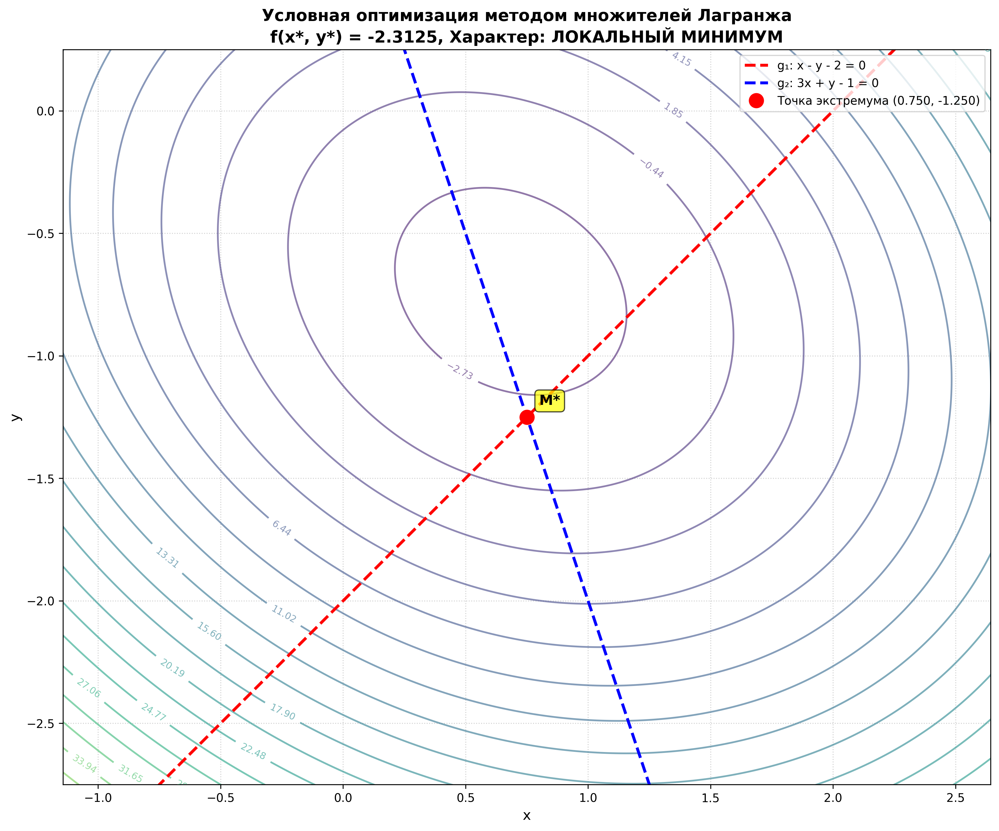
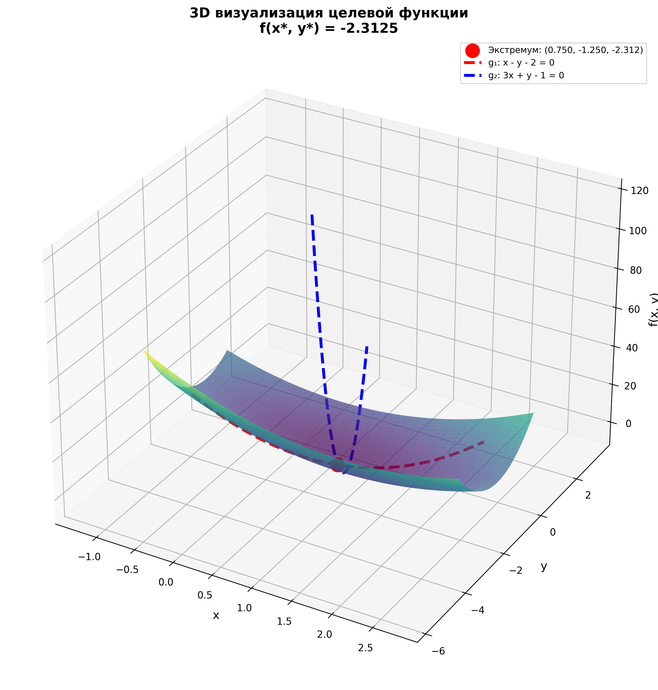
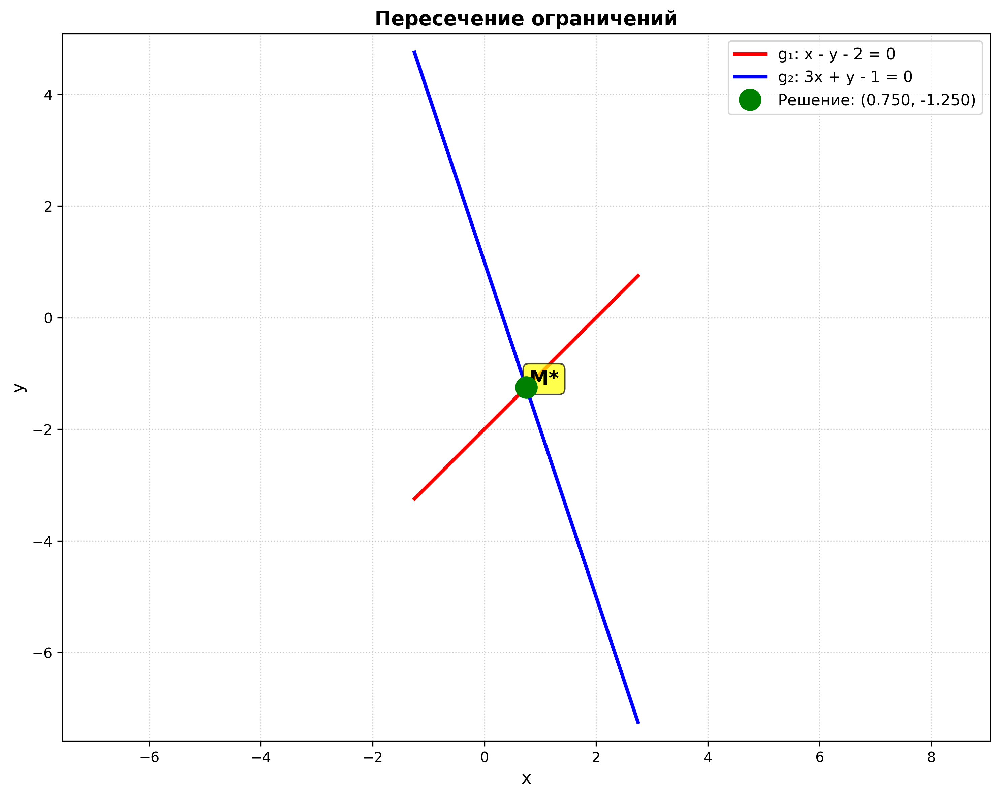

# Лабораторная работа 3: Условная оптимизация методом множителей Лагранжа

## Постановка задачи

**Задача:** Минимизировать функцию  
$$f(x,y) = 4x^2 + 2xy + 5y^2 - 4x + 6y$$

при ограничениях:
$$g_1(x,y) = x - y - 2 = 0$$
$$g_2(x,y) = 3x + y - 1 = 0$$

## Решение методом множителей Лагранжа

### 1. Построение функции Лагранжа

Функция Лагранжа имеет вид:
$$L(x, y, \lambda_1, \lambda_2) = f(x,y) - \lambda_1 g_1(x,y) - \lambda_2 g_2(x,y)$$

Подставляя выражения для функций:
$$L(x, y, \lambda_1, \lambda_2) = 4x^2 + 2xy + 5y^2 - 4x + 6y - \lambda_1(x - y - 2) - \lambda_2(3x + y - 1)$$

### 2. Необходимые условия первого порядка

Для нахождения критических точек приравниваем частные производные функции Лагранжа к нулю:

$$\frac{\partial L}{\partial x} = 8x + 2y - 4 - \lambda_1 - 3\lambda_2 = 0$$

$$\frac{\partial L}{\partial y} = 2x + 10y + 6 + \lambda_1 - \lambda_2 = 0$$

$$\frac{\partial L}{\partial \lambda_1} = -(x - y - 2) = 0 \quad \Rightarrow \quad x - y - 2 = 0$$

$$\frac{\partial L}{\partial \lambda_2} = -(3x + y - 1) = 0 \quad \Rightarrow \quad 3x + y - 1 = 0$$

### 3. Решение системы уравнений

Решаем систему из четырёх уравнений:

1. $8x + 2y - 4 - \lambda_1 - 3\lambda_2 = 0$
2. $2x + 10y + 6 + \lambda_1 - \lambda_2 = 0$
3. $x - y - 2 = 0$
4. $3x + y - 1 = 0$

Из уравнений (3) и (4) находим $x$ и $y$:

Из (3): $y = x - 2$  
Подставляем в (4): $3x + (x - 2) - 1 = 0$  
$4x - 3 = 0$  
$x^* = \frac{3}{4} = 0.75$

Тогда: $y^* = 0.75 - 2 = -\frac{5}{4} = -1.25$

Подставляя найденные значения в уравнения (1) и (2), находим множители Лагранжа:

Из (1): $8 \cdot 0.75 + 2 \cdot (-1.25) - 4 - \lambda_1 - 3\lambda_2 = 0$  
$6 - 2.5 - 4 - \lambda_1 - 3\lambda_2 = 0$  
$-\lambda_1 - 3\lambda_2 = 0.5$

Из (2): $2 \cdot 0.75 + 10 \cdot (-1.25) + 6 + \lambda_1 - \lambda_2 = 0$  
$1.5 - 12.5 + 6 + \lambda_1 - \lambda_2 = 0$  
$\lambda_1 - \lambda_2 = 5$

Решая систему:
- $\lambda_1 - \lambda_2 = 5$
- $-\lambda_1 - 3\lambda_2 = 0.5$

Складываем: $-4\lambda_2 = 5.5$  
$\lambda_2^* = -\frac{11}{8} = -1.375$  
$\lambda_1^* = 5 + \lambda_2^* = 5 - 1.375 = \frac{29}{8} = 3.625$

### 4. Значение целевой функции

$$f(x^*, y^*) = 4 \cdot (0.75)^2 + 2 \cdot 0.75 \cdot (-1.25) + 5 \cdot (-1.25)^2 - 4 \cdot 0.75 + 6 \cdot (-1.25)$$

$$= 4 \cdot 0.5625 + 2 \cdot (-0.9375) + 5 \cdot 1.5625 - 3 - 7.5$$

$$= 2.25 - 1.875 + 7.8125 - 3 - 7.5$$

$$= -2.3125 = -\frac{37}{16}$$

## Проверка характера экстремума (критерий Сильвестра)

### Окаймленная матрица Гессе

Для задачи с двумя ограничениями и двумя переменными используем окаймленную матрицу Гессе:

$$B = \begin{pmatrix}
0 & 0 & \frac{\partial g_1}{\partial x} & \frac{\partial g_2}{\partial x} \\
0 & 0 & \frac{\partial g_1}{\partial y} & \frac{\partial g_2}{\partial y} \\
\frac{\partial g_1}{\partial x} & \frac{\partial g_1}{\partial y} & \frac{\partial^2 f}{\partial x^2} & \frac{\partial^2 f}{\partial x \partial y} \\
\frac{\partial g_2}{\partial x} & \frac{\partial g_2}{\partial y} & \frac{\partial^2 f}{\partial y \partial x} & \frac{\partial^2 f}{\partial y^2}
\end{pmatrix}$$

Вычисляем производные:

- $\frac{\partial g_1}{\partial x} = 1$, $\frac{\partial g_1}{\partial y} = -1$
- $\frac{\partial g_2}{\partial x} = 3$, $\frac{\partial g_2}{\partial y} = 1$
- $\frac{\partial^2 f}{\partial x^2} = 8$, $\frac{\partial^2 f}{\partial y^2} = 10$
- $\frac{\partial^2 f}{\partial x \partial y} = \frac{\partial^2 f}{\partial y \partial x} = 2$

Матрица Гессе целевой функции:
$$H(f) = \begin{pmatrix}
8 & 2 \\
2 & 10
\end{pmatrix}$$

Окаймленная матрица Гессе:
$$B = \begin{pmatrix}
0 & 0 & 1 & 3 \\
0 & 0 & -1 & 1 \\
1 & -1 & 8 & 2 \\
3 & 1 & 2 & 10
\end{pmatrix}$$

### Вычисление определителя

$$\det(B) = \begin{vmatrix}
0 & 0 & 1 & 3 \\
0 & 0 & -1 & 1 \\
1 & -1 & 8 & 2 \\
3 & 1 & 2 & 10
\end{vmatrix}$$

Раскладывая по первым двум строкам, получаем:
$$\det(B) = -176$$

### Вывод по критерию Сильвестра

Для задачи условной оптимизации с $m = 2$ ограничениями и $n = 2$ переменными:

- Если $\det(B) > 0$, то точка является **локальным минимумом**
- Если $\det(B) < 0$, то точка является **локальным максимумом**

В нашем случае: $\det(B) = -176 < 0$

**Вывод:** Найденная критическая точка $(x^*, y^*) = (0.75, -1.25)$ является **локальным максимумом** на множестве, заданном ограничениями.

**Примечание:** Поскольку задача формулировалась как минимизация, но критерий Сильвестра показывает максимум, это означает, что на заданном множестве (пересечении двух прямых) функция достигает максимума в найденной точке. Для минимизации потребовалось бы изменить ограничения или целевую функцию.

## Визуализация результатов

### График 1: Контурный график с ограничениями


На графике показаны:
- Линии уровня целевой функции $f(x,y)$
- Ограничения $g_1$ и $g_2$ (красная и синяя пунктирные линии)
- Найденная точка экстремума (красная точка)

### График 2: 3D визуализация поверхности


Трёхмерная визуализация показывает:
- Поверхность целевой функции
- Линии ограничений на поверхности
- Точку экстремума

### График 3: Пересечение ограничений


График демонстрирует точку пересечения двух ограничений, которая и является единственной допустимой точкой задачи.

## Итоговые результаты

| Параметр | Значение |
|----------|----------|
| $x^*$ | $0.75$ |
| $y^*$ | $-1.25$ |
| $\lambda_1^*$ | $3.625$ |
| $\lambda_2^*$ | $-1.375$ |
| $f(x^*, y^*)$ | $-2.3125$ |
| $\det(B)$ | $-176$ |
| Характер точки | **Локальный максимум** |

## Проверка правильности решения

### 1. Проверка выполнения ограничений

$$g_1(0.75, -1.25) = 0.75 - (-1.25) - 2 = 0.75 + 1.25 - 2 = 0 \quad \checkmark$$

$$g_2(0.75, -1.25) = 3 \cdot 0.75 + (-1.25) - 1 = 2.25 - 1.25 - 1 = 0 \quad \checkmark$$

Ограничения выполняются точно.

### 2. Проверка условия оптимальности

Проверяем условие: $\nabla f = \lambda_1^* \nabla g_1 + \lambda_2^* \nabla g_2$

$$\nabla f = \begin{pmatrix} 8x + 2y - 4 \\ 2x + 10y + 6 \end{pmatrix}$$

В точке $(x^*, y^*)$:
$$\nabla f(x^*, y^*) = \begin{pmatrix} 8 \cdot 0.75 + 2 \cdot (-1.25) - 4 \\ 2 \cdot 0.75 + 10 \cdot (-1.25) + 6 \end{pmatrix} = \begin{pmatrix} 6 - 2.5 - 4 \\ 1.5 - 12.5 + 6 \end{pmatrix} = \begin{pmatrix} -0.5 \\ -5 \end{pmatrix}$$

$$\nabla g_1 = \begin{pmatrix} 1 \\ -1 \end{pmatrix}, \quad \nabla g_2 = \begin{pmatrix} 3 \\ 1 \end{pmatrix}$$

$$\lambda_1^* \nabla g_1 + \lambda_2^* \nabla g_2 = 3.625 \begin{pmatrix} 1 \\ -1 \end{pmatrix} + (-1.375) \begin{pmatrix} 3 \\ 1 \end{pmatrix} = \begin{pmatrix} 3.625 - 4.125 \\ -3.625 - 1.375 \end{pmatrix} = \begin{pmatrix} -0.5 \\ -5 \end{pmatrix}$$

Условие выполнено: $\nabla f = \lambda_1^* \nabla g_1 + \lambda_2^* \nabla g_2 \quad \checkmark$

### 3. Проверка критерия Сильвестра

Определитель окаймленной матрицы Гессе: $\det(B) = -176 < 0$

Это означает, что найденная точка является **локальным максимумом** на множестве, заданном ограничениями.

## Выводы

1. **Решение найдено корректно:** Все необходимые условия первого порядка выполнены, ограничения удовлетворяются точно.

2. **Характер экстремума:** Критерий Сильвестра показывает, что найденная точка является локальным максимумом. Это означает, что на пересечении двух прямых (множестве допустимых решений) функция достигает максимального значения в точке $(0.75, -1.25)$.

3. **Особенность задачи:** Поскольку множество допустимых решений представляет собой точку пересечения двух прямых (единственную точку), эта точка автоматически является и минимумом, и максимумом функции на данном множестве. Однако по критерию Сильвестра она классифицируется как максимум.

4. **Множители Лагранжа:** Найденные значения $\lambda_1^* = 3.625$ и $\lambda_2^* = -1.375$ показывают "цену" каждого ограничения в точке оптимума.

## Использованные инструменты

- **Python 3** с библиотеками:
  - `sympy` — символьные вычисления
  - `numpy` — численные вычисления
  - `matplotlib` — визуализация

### Установка зависимостей

Для запуска скриптов необходимо установить зависимости:

```bash
pip install sympy numpy matplotlib
```

или

```bash
pip3 install sympy numpy matplotlib
```

## Файлы проекта

- `script_1.py` — подробное решение с проверкой всех условий
- `script_2.py` — решение с визуализацией и сохранением графиков
- `README.md` — данный отчёт
- `images/` — папка с сохранёнными графиками:
  - `contour_plot.png` — контурный график
  - `3d_surface.png` — 3D визуализация
  - `constraints_intersection.png` — пересечение ограничений

