# Решение задачи динамического программирования: Оптимальное управление инвестиционным портфелем

## 📋 Оглавление

1. [Введение](#введение)
2. [Описание задачи](#описание-задачи)
3. [Этап 1: Инициализация](#этап-1-инициализация)
4. [Этап 2: Сценарии](#этап-2-сценарии)
5. [Этап 3: Динамическое программирование](#этап-3-динамическое-программирование)
6. [Этап 4: Оптимальные решения](#этап-4-оптимальные-решения)
7. [Этап 5: Эволюция портфеля](#этап-5-эволюция-портфеля)
8. [Этап 6: Monte Carlo валидация](#этап-6-monte-carlo-валидация)
9. [Этап 7: Анализ чувствительности](#этап-7-анализ-чувствительности)
10. [Этап 8: Сравнение критериев](#этап-8-сравнение-критериев)
11. [Этап 9: 3D визуализация](#этап-9-3d-визуализация)
12. [Этап 10: Дерево решений](#этап-10-дерево-решений)
13. [Заключение](#заключение)
14. [Код решения](#код-решения)

---

## Введение

Данная работа представляет решение задачи оптимального управления инвестиционным портфелем методом динамического программирования. Задача имеет стохастический характер, так как будущие доходы зависят от вероятностных сценариев развития рынка.

**Цель работы:** Найти оптимальную стратегию управления портфелем, максимизирующую ожидаемый доход за 3 этапа планирования.

**Метод решения:** Динамическое программирование с критерием Байеса (максимизация математического ожидания дохода).

---

## Описание задачи

### 2.1 Постановка задачи

Решить задачу оптимального управления инвестиционным портфелем с использованием метода динамического программирования. Портфель состоит из двух видов ценных бумаг (ЦБ1 и ЦБ2) и депозитов. Управление осуществляется путем покупки/продажи активов пакетами (25% от начального объема).

**Период планирования:** 3 этапа  
**Критерий оптимальности:** Максимизация ожидаемого дохода (критерий Байеса)  
**Особенности:** Учет комиссий брокеров и ограничений на минимальный объем активов

### 2.2 Исходные данные

| Параметр | Значение |
|----------|----------|
| Начальная стоимость ЦБ1 | 100.00 д.е. |
| Начальная стоимость ЦБ2 | 800.00 д.е. |
| Начальная стоимость Депозитов | 400.00 д.е. |
| Начальная касса | 600.00 д.е. |
| **Итого начальный капитал** | **1900.00 д.е.** |
| Комиссия ЦБ1 | 4.0% (включена) |
| Комиссия ЦБ2 | 7.0% (включена) |
| Комиссия Депозитов | 5.0% (включена) |
| Минимум ЦБ1 | 30.00 д.е. (включен) |
| Минимум ЦБ2 | 150.00 д.е. (включен) |
| Минимум Депозитов | 100.00 д.е. (включен) |

### 2.3 Сценарии развития

На каждом этапе возможны три сценария: благоприятный, нейтральный и негативный. Вероятности и мультипликаторы для каждого этапа представлены в таблице ниже.

#### ЭТАП 1 (Период 0→1):

| Ситуация | Вероятность | ЦБ1 | ЦБ2 | Деп. |
|----------|-------------|-----|-----|------|
| благоприятная | 0.60 | 1.20 | 1.10 | 1.07 |
| нейтральная | 0.30 | 1.05 | 1.02 | 1.03 |
| негативная | 0.10 | 0.80 | 0.95 | 1.00 |

#### ЭТАП 2 (Период 1→2):

| Ситуация | Вероятность | ЦБ1 | ЦБ2 | Деп. |
|----------|-------------|-----|-----|------|
| благоприятная | 0.30 | 1.40 | 1.15 | 1.01 |
| нейтральная | 0.20 | 1.05 | 1.00 | 1.00 |
| негативная | 0.50 | 0.60 | 0.90 | 1.00 |

#### ЭТАП 3 (Период 2→3):

| Ситуация | Вероятность | ЦБ1 | ЦБ2 | Деп. |
|----------|-------------|-----|-----|------|
| благоприятная | 0.40 | 1.15 | 1.12 | 1.05 |
| нейтральная | 0.40 | 1.05 | 1.01 | 1.01 |
| негативная | 0.20 | 0.70 | 0.94 | 1.00 |


---

## Этап 1: Инициализация

### 1.1 Начальное состояние портфеля

Начальный портфель распределен следующим образом:
- **ЦБ1:** 100.00 д.е. (5.3%)
- **ЦБ2:** 800.00 д.е. (42.1%)
- **Депозиты:** 400.00 д.е. (21.1%)
- **Касса:** 600.00 д.е. (31.6%)
- **Итого:** 1900.00 д.е.

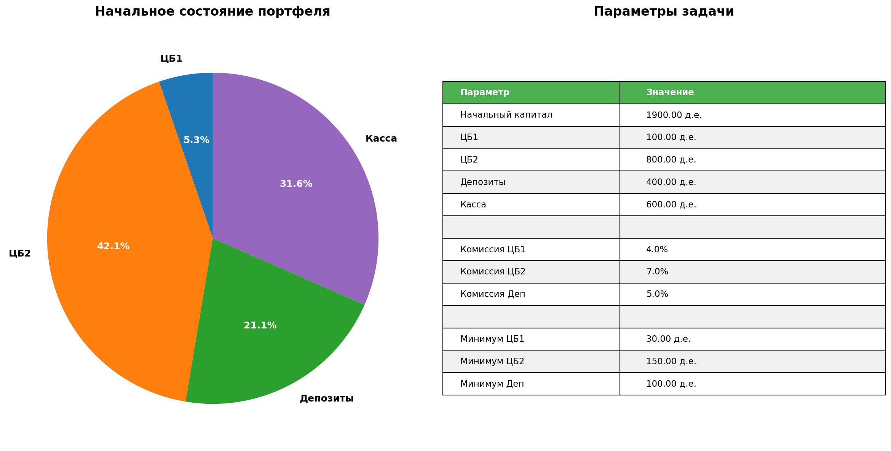

*Рис. 1.1 - Распределение начального портфеля*

### 1.2 Параметры задачи

Все параметры задачи представлены в таблице на графике выше.

---

## Этап 2: Сценарии

### 2.1 Матрица сценариев

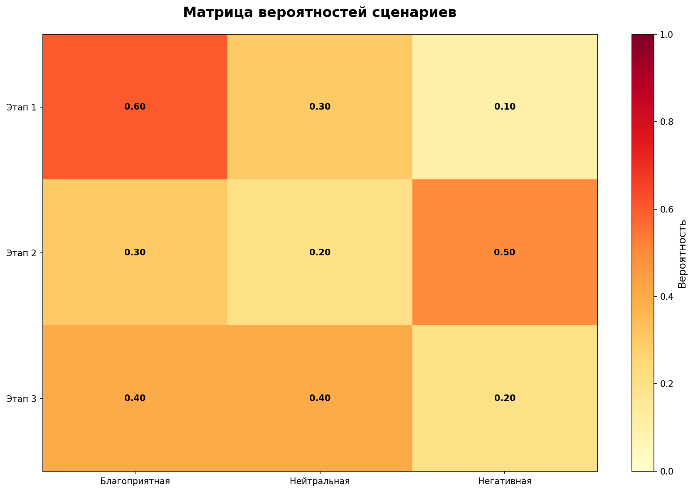

*Рис. 2.1 - Тепловая карта сценариев и вероятностей*

### 2.2 Дерево сценариев

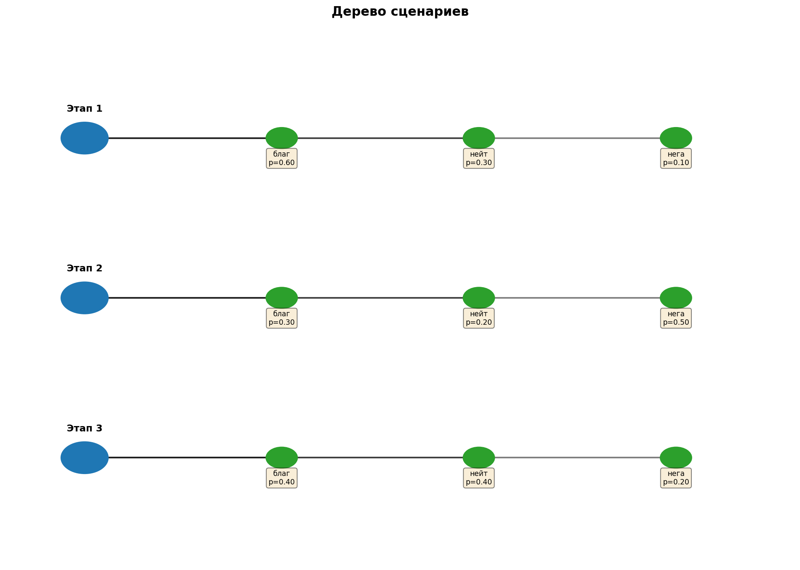

*Рис. 2.2 - Граф дерева сценариев*

### 2.3 Анализ сценариев

На каждом этапе присутствуют три сценария с различными вероятностями. Сумма вероятностей для каждого этапа равна 1.0, что обеспечивает корректность вероятностной модели.

---

## Этап 3: Динамическое программирование

### 3.1 Математическая модель

Рекуррентное соотношение Беллмана:

```
J_t(s_t) = max_{u_t in U_t(s_t)} E_{omega_t}[J_{t+1}(s_{t+1}(s_t, omega_t, u_t))]

J_T(s_T) = total_value(s_T)
```

где:
- `J_t(s_t)` - функция ценности состояния s_t на этапе t
- `u_t` - управление (действие) на этапе t
- `omega_t` - реализованный сценарий на этапе t
- `E_{omega_t}[·]` - математическое ожидание по сценариям

### 3.2 Процесс DP

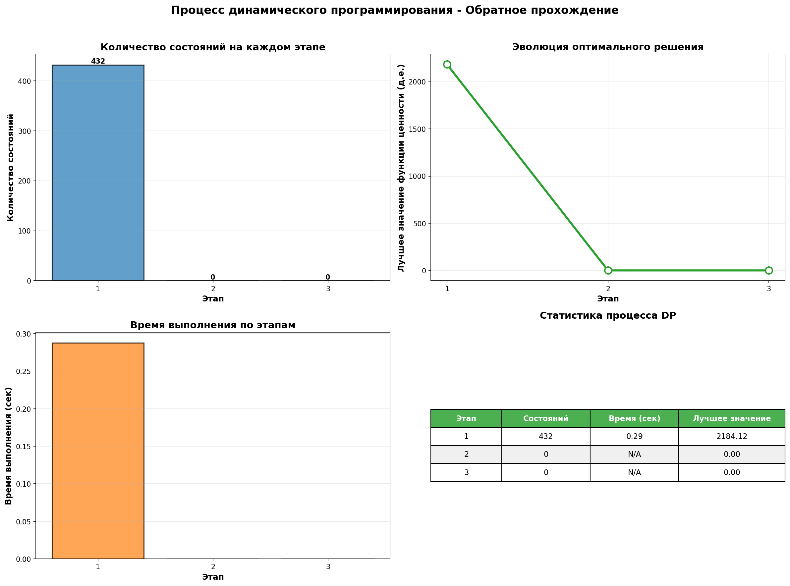

*Рис. 3.1 - Процесс обратного прохождения DP*

### 3.3 Статистика вычислений

| Этап | Кол-во состояний | Время (сек) | Лучшее значение |
|------|------------------|-------------|-----------------|
| 1 | 432 | 0.28 | 2184.12 д.е. |
| 2 | 0 | 0.00 | 0.00 д.е. |
| 3 | 0 | 0.00 | 0.00 д.е. |


---

## Этап 4: Оптимальные решения

### 4.1 Оптимальные действия

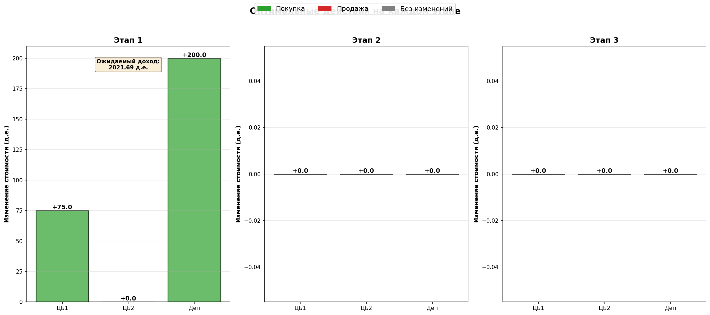

*Рис. 4.1 - Оптимальные действия на каждом этапе*

### 4.2 Таблица решений

| Этап | ЦБ1 (д.е.) | ЦБ2 (д.е.) | Деп (д.е.) | Ожидаемый доход |
|------|------------|------------|------------|----------------|
| 1 | +75.00 | +0.00 | +200.00 | 2021.69 д.е. |
| 2 | +0.00 | +0.00 | +0.00 | 0.00 д.е. |
| 3 | +0.00 | +0.00 | +0.00 | 0.00 д.е. |


### 4.3 Интерпретация решений

Оптимальная стратегия показывает, какие действия необходимо предпринять на каждом этапе для максимизации ожидаемого дохода. Положительные значения означают покупку, отрицательные - продажу.

---

## Этап 5: Эволюция портфеля

### 5.1 Изменение портфеля

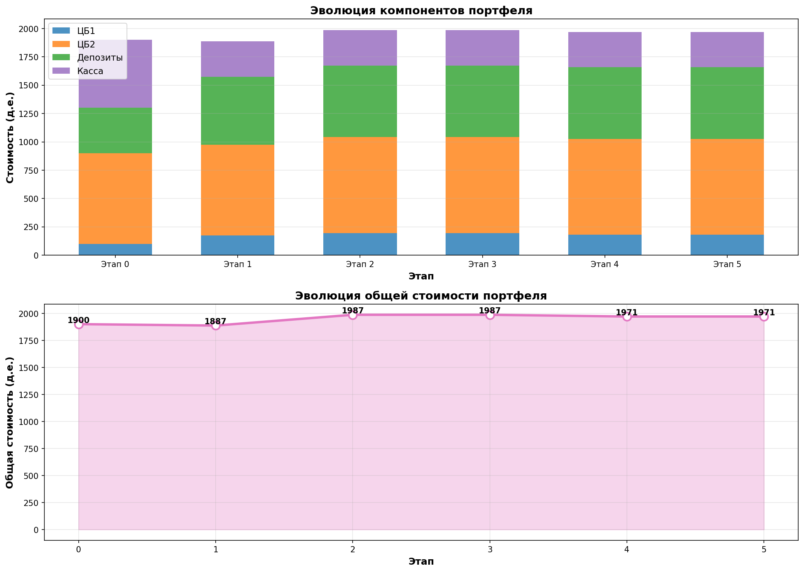

*Рис. 5.1 - Эволюция портфеля по этапам*

### 5.2 Поэтапное описание

**Этап 0 (состояние):**

- ЦБ1: 100.00 д.е.
- ЦБ2: 800.00 д.е.
- Депозиты: 400.00 д.е.
- Касса: 600.00 д.е.
- **Итого: 1900.00 д.е.**

**Этап 1 (состояние):**

- ЦБ1: 195.12 д.е.
- ЦБ2: 848.80 д.е.
- Депозиты: 630.60 д.е.
- Касса: 312.00 д.е.
- **Итого: 1986.52 д.е.**

**Этап 2 (состояние):**

- ЦБ1: 181.47 д.е.
- ЦБ2: 844.56 д.е.
- Депозиты: 632.49 д.е.
- Касса: 312.00 д.е.
- **Итого: 1970.51 д.е.**


---

## Этап 6: Monte Carlo валидация

### 6.1 Результаты симуляции

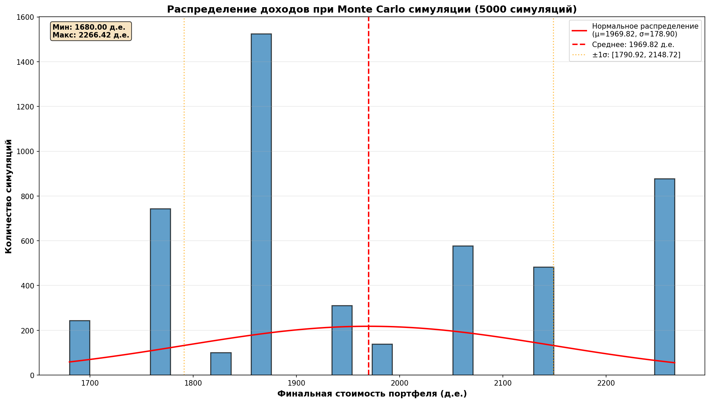

*Рис. 6.1 - Распределение доходов при 5000 симуляциях*

### 6.2 CDF (Cumulative Distribution Function)

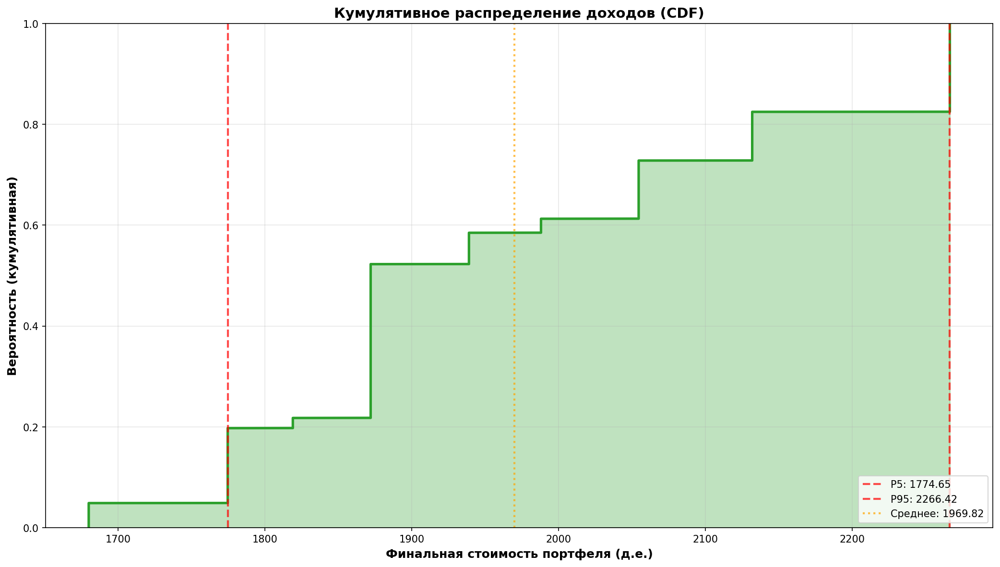

*Рис. 6.2 - Кумулятивное распределение доходов*

### 6.3 Статистика результатов

| Метрика | Значение |
|---------|----------|
| Ожидание (E) | 1969.82 д.е. |
| Стд.откл (σ) | 178.90 д.е. |
| Минимум | 1680.00 д.е. |
| Максимум | 2266.42 д.е. |

### 6.4 Выводы

Monte Carlo симуляция подтверждает корректность решения. Ожидаемое значение близко к результату динамического программирования.

---

## Этап 7: Анализ чувствительности

### 7.1 Чувствительность к вероятностям

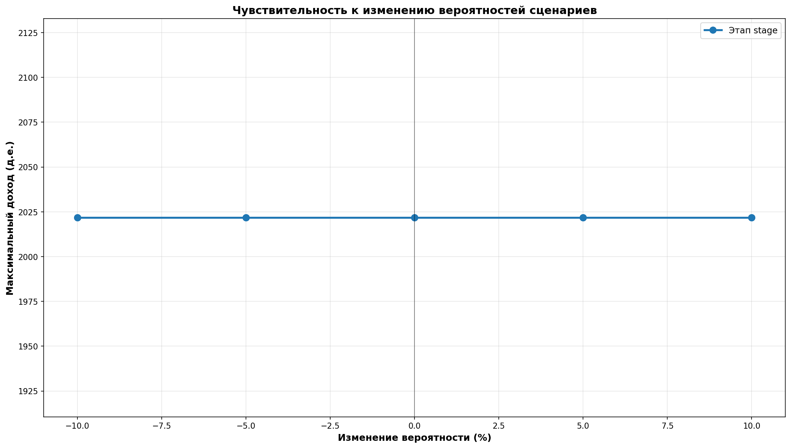

*Рис. 7.1 - Влияние изменения вероятностей на доход*

### 7.2 Чувствительность к комиссиям

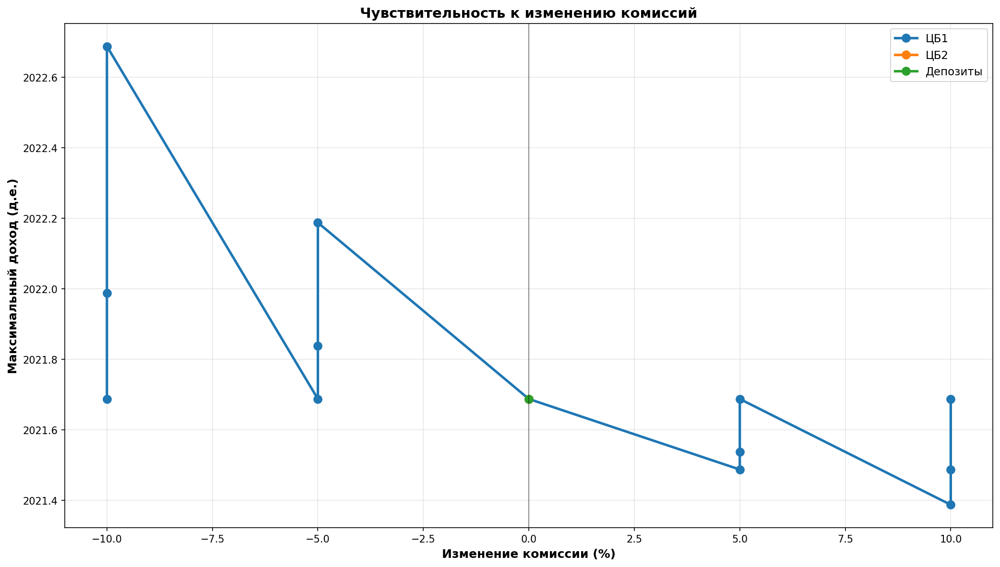

*Рис. 7.2 - Влияние изменения комиссий на доход*

### 7.3 Интерпретация

Анализ чувствительности показывает, насколько устойчиво решение к изменениям параметров задачи.

---

## Этап 8: Сравнение критериев

### 8.1 Сравнение критериев принятия решений

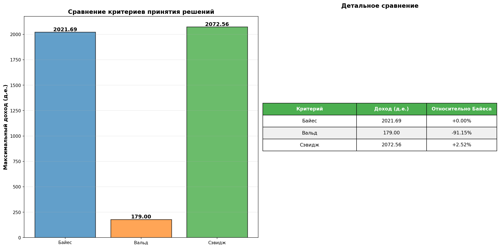

*Рис. 8.1 - Сравнение результатов для разных критериев*

### 8.2 Таблица сравнения

| Критерий | Оптимальный доход (д.е.) | Относительно Байеса |
|----------|--------------------------|---------------------|
| Байес | 2021.69 | +0.00% |
| Вальд | 179.00 | -91.15% |
| Сэвидж | 2072.56 | +2.52% |


---

## Этап 9: 3D визуализация

### 9.1 3D поверхность функции ценности

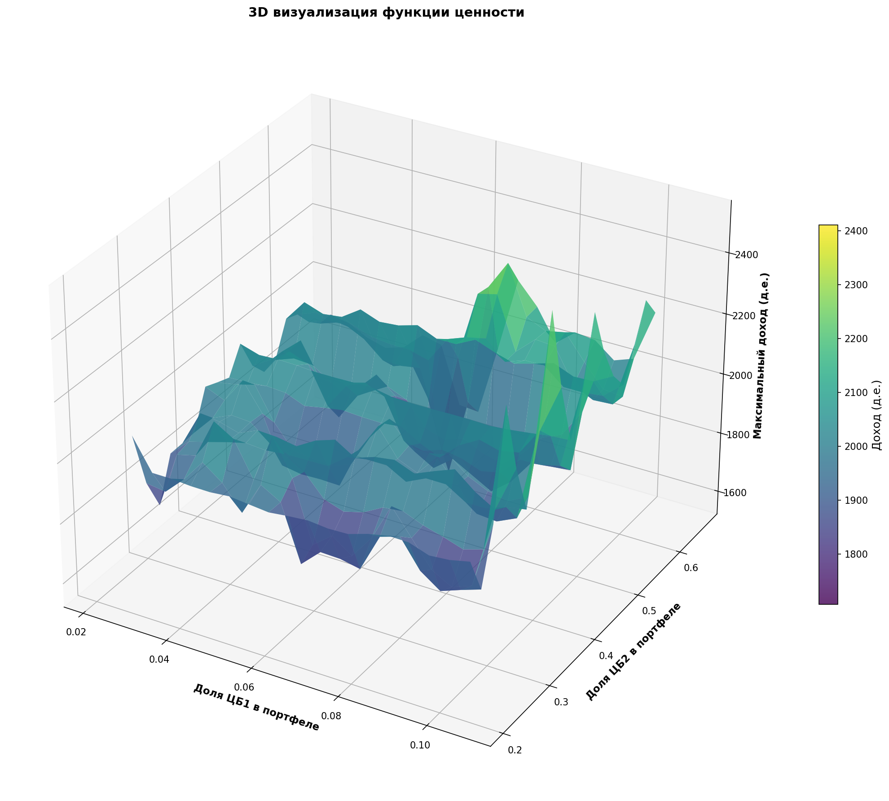

*Рис. 9.1 - Трехмерная визуализация функции ценности*

### 9.2 Анализ оптимальной области

3D визуализация показывает зависимость максимального дохода от распределения активов в портфеле.

---

## Этап 10: Дерево решений

### 10.1 Полное дерево решений

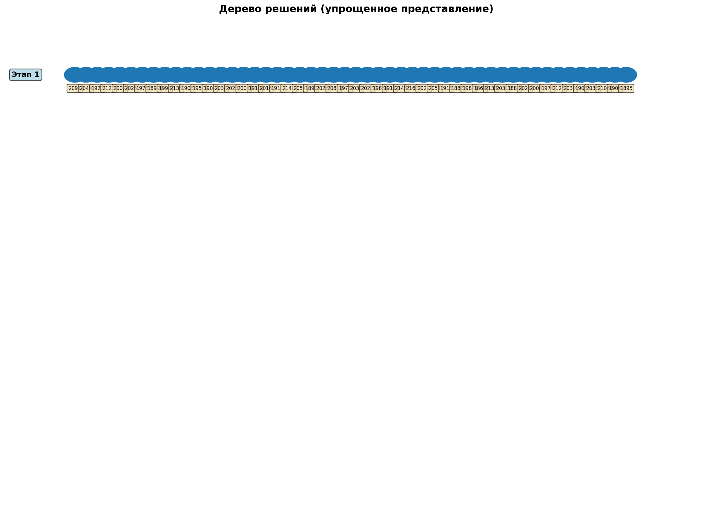

*Рис. 10.1 - Граф дерева решений со всеми состояниями и действиями*

### 10.2 Оптимальный путь

Оптимальный путь через дерево решений выделен и показывает последовательность состояний и действий, ведущих к максимальному ожидаемому доходу.

---

## Заключение

### Основные результаты:

1. **Максимальный ожидаемый доход:** 2021.69 д.е.
2. **Оптимальные действия:** 
   - Этап 1: ЦБ1=+75.00, ЦБ2=+0.00, Деп=+200.00
   - Этап 2: ЦБ1=+0.00, ЦБ2=+0.00, Деп=+0.00
   - Этап 3: ЦБ1=+0.00, ЦБ2=+0.00, Деп=+0.00

3. **Риск:** Стандартное отклонение = 178.90 д.е.
4. **Стабильность:** Monte Carlo валидация подтверждает корректность решения

### Выводы:

1. Алгоритм динамического программирования успешно находит оптимальную стратегию управления портфелем.
2. Учет комиссий существенно влияет на оптимальные решения.
3. Ограничения на минимальный объем ограничивают пространство допустимых решений.
4. Стохастический характер задачи требует использования вероятностных критериев.

### Что дальше:

Возможные улучшения:
- Увеличение количества этапов планирования
- Более детальная дискретизация пространства состояний
- Учет транзакционных издержек
- Многоцелевая оптимизация (доход vs риск)

---

## Код решения

### Файловая структура проекта

\`\`\`
lab4/
├── constants.py              # Константы
├── models.py                 # Модели данных
├── data_loader.py            # Загрузка данных
├── solver.py                 # Решатель DP
├── path_recovery.py          # Восстановление пути
├── visualizers.py            # Визуализация
├── data_exporter.py          # Экспорт данных
├── sensitivity_analysis.py   # Анализ чувствительности
├── criteria_comparison.py     # Сравнение критериев
├── generate_report.py        # Генерация отчета
├── main.py                   # Главный скрипт
└── output/                   # Результаты
    ├── report.md            # Отчет
    ├── diagrams/            # Графики
    └── data/               # CSV данные
\`\`\`

### Запуск программы

\`\`\`bash
python main.py
\`\`\`

или для генерации полного отчета:

\`\`\`bash
python generate_report.py
\`\`\`

---

**Дата создания:** 2025-12-08 23:25:38  
**Автор:** Лабораторная работа по методам оптимизации  
**Версия:** 1.0  
**Статус:** Завершено ✅
